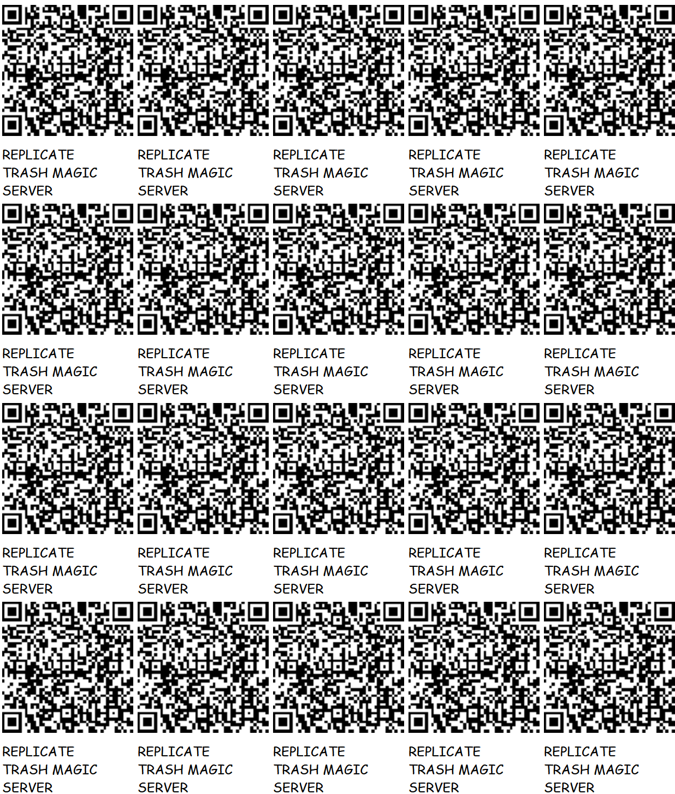
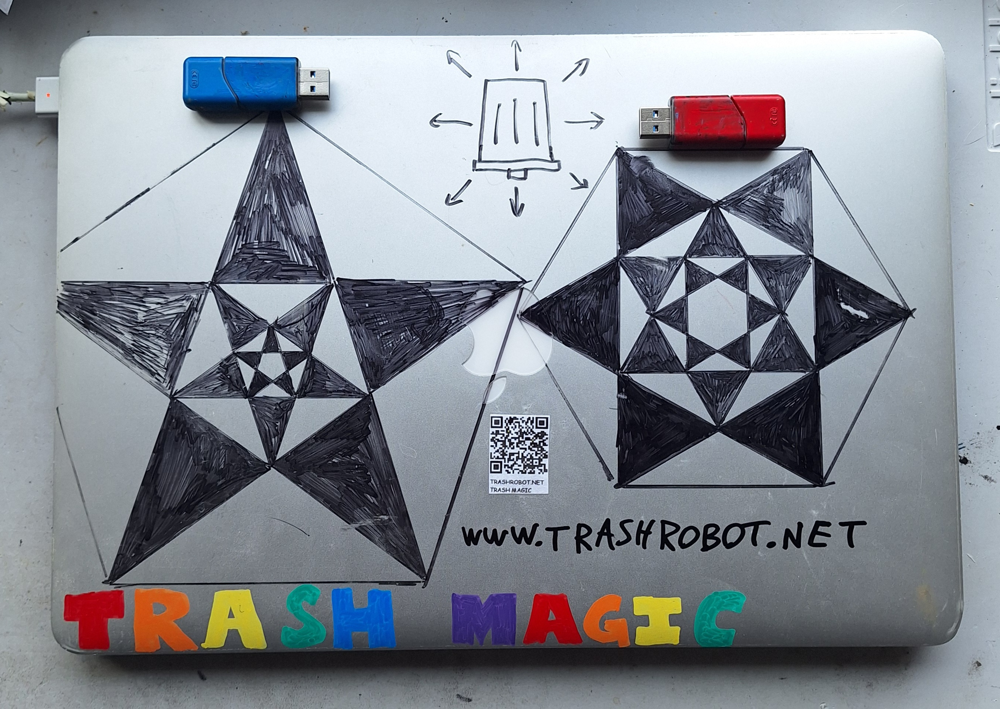
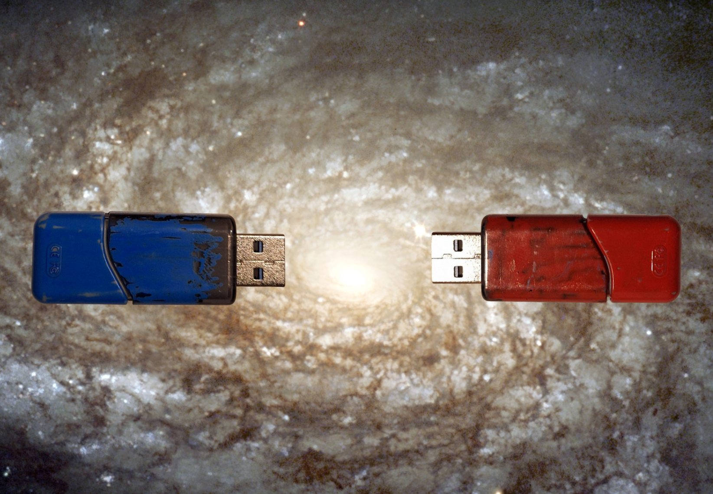
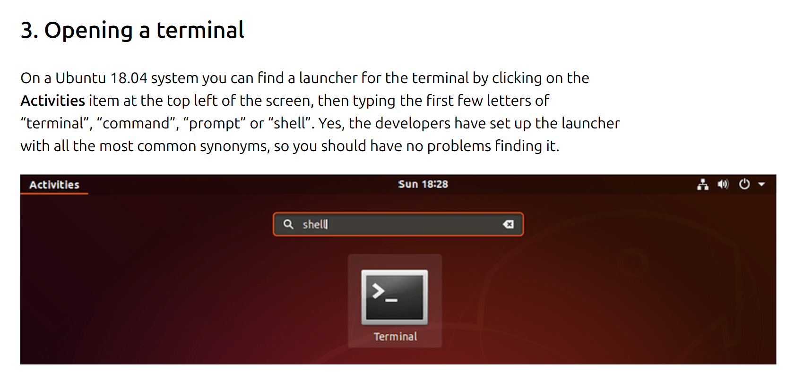

# REPLICATE TRASH MAGIC SERVER!





## WHAT YOU NEED FOR THIS:

 - TWO THUMB DRIVES WITH AT LEAST 8 GIGABYTES!
 - PAINT PENS!
 - A COMPUTER THAT IS NOT NEEDED FOR OTHER PURPOSES WHICH HAS A [USB TYPE A](https://en.wikipedia.org/wiki/USB_hardware) CONNECTION AND IS NOT EITHER A CHROME BOOK OR A RECENT APPLE!
 - A SECOND COMPUTER THAT ALSO HAS AN INTERNET CONNECTION AND USB A CONNECTION(OR CONVERTER FROM C TO A) TO DOWNLOAD THE INSTALL IMAGE(THIS CAN ALSO BE A TRASH MAGIC SERVER)
 - AN INTERNET CONNECTION, PREFERABLY A FAST ONE!
 - MAYBE AN HOUR OR TWO OF TIME

## STEP 1: PREPARE THE COMPUTER

MAKE ABSOLUTELY SURE THAT WHOEVER DONATED THE LAPTOP HAS GOT ALL THEIR DATA!  ALSO MAKE SURE THEY HAVE THEN DELETED ALL THEIR PERSONAL DATA FROM THE MACHINE TO BE SAFE!

## STEP 2: PAINT THE THUMB DRIVES!

WE USE BLUE TO INDICATED CONTENT AND RED TO INDICATE PLATFORM! THIS DISTINCTION IS USEFUL ENOUGH TO HAVE THIS BE A STEP ON ITS OWN!

WE USE BOTH COLORS AS A REJECTION OF THE BLUE PILL/RED PILL BINARY PRESENTED IN THE MATRIX!  BOTH PILLS ARE TAKEN AND WE ACCEPT THE DUALITY OF THE UNIVERSE!



## STEP 3: DOWNLOAD IMAGE FOR INSTALLING UBUNTU STUDIO!


### [CLICK HERE FOR DOWNLOAD PAGE!](https://ubuntustudio.org/download/)

YOU CAN JUST DOWNLOAD IT TO YOUR "DOWNLOADS" FOLDER AND LEAVE IT THERE, SINCE THAT'S EASY TO FIND!

## STEP 3: INSTALL [BALENA ETCHER](https://etcher.balena.io/) ON THE OTHER MACHINE!

### [CLICK HERE TO GO TO  DOWNLOAD PAGE!](https://etcher.balena.io/#download-etcher)

BALENA ETCHER IS FREE SOFTWARE THAT RUNS ON ALL MAJOR OPERATING SYSTEMS THAT CAN WRITE A UBUNTU INSTALL IMAGE ON A THUMB DRIVE! 

DOWNLOAD AND INSTALL THE SOFTWARE! IF YOU'RE ON AN EXISTING TRASH MAGIC SERVER(WHICH RUNS UBUNTU LINUX) YOU CAN JUST UNZIP THE FILE YOU DOWNLOAD AND THEN RUN THE PROGRAM BY CLICKING ON THE FILE CALLED "balena etcher" IN THE UNZIPPED FOLDER!


## STEP 4: FLASH INSTALL IMAGE ONTO RED THUMB DRIVE

PLACE RED PAINTED THUMB DRIVE INTO THE USB SLOT OF YOUR EXISTING COMPUTER!

IF YOU HAVE A NEWER COMPUTER YOU MIGHT NEED A CONVERTER TO FROM USB C TO USB A!

RUN BALENA ETCHER!  IT WILL ASK YOU WHERE THE IMAGE IS, AND YOU CAN GO FIND THAT IN YOUR DOWNLOADS FOLDER, AND IT WILL ALSO ASK WHAT DRIVE TO INSTALL, AND MAKE SURE IT'S THE ONE YOU JUST PLUGGED IN!

BE SURE THAT THIS THUMB DRIVE HAS NOTHING YOU DON'T WANT TO LOSE ON IT!

RUN BALENA ETCHER, WHICH WILL TAKE A FEW MINUTES AT LEAST, AND THAT WILL THEN BECOME YOUR INSTALL DISK!

EJECT THE DISK!

THIS IS NOW THE SEED THAT WILL MAKE TRASH(OLD COMPUTERS) INTO MAGIC! 

MAKE AS MANY AS YOU WANT!

## STEP 5: INSTALL UBUNTU STUDIO!

LAST CHANCE TO SAVE ANY DATA FROM THE OLD MACHINE!

AFTER YOU'RE SURE THERE'S NOT DATA YOU DON'T WANT TO LOSE, PUT THE THUMB DRIVE IN A USB A SLOT AND TURN THE COMPUTER ON WHILE PRESSING ONE OF THE FUNCTION KEYS. WHICH ONE?  DEPENDS ON YOUR COMPUTER! TRY GOOGLING "[make and model of your computer] INSTALL LINUX FROM THUMB DRIVE" OR SOMETHING LIKE THAT AND HOPEFULLY YOU CAN FIND THE RIGHT ONE FOR THE MACHINE YOU HAVE!  THIS CAN ALSO TURN UP IF YOU HAVE SOME WEIRD MACHINE THAT THIS WON'T WORK ON!  SOME MACHINES DON'T WORK WITHOUT A BUNCH OF NONSENSE, BUT YOU USUALLY JUST DO A BUNCH OF SEARCHES AND TRY THINGS AT RANDOM!  THIS DOESN'T REALLY REQUIRE TECHNICAL "SKILL" EXACTLY, JUST PATIENCE AND A WILLINGNESS TO TRY THINGS AND NAVIGATE ANNOYING ONLINE FORUMS FULL OF ANNOYING PEOPLE!

ONCE YOU GET THE INSTALL TO START WORKING, YOU'VE GOT MAYBE THE BETTER PART OF AN HOUR OF THE USUAL COMPUTER SETUP TYPE STUFF, YOU WILL CLICK "OK" MANY TIMES, SET THE TIME ZONE, SET THE LANGUAGE, AND SET A USERNAME AND PASSWORD!

WE WANT THE USERNAME AND PASSWORD TO BOTH BE VERY SIMPLE, VERY EASY TO GUESS, AND ALSO WRITTEN IN HUGE LETTERS IN PAINT PEN IN MULTIPLE PLACES ON THE COMPUTER!  THIS MACHINE IS ABOUT TO BECOME LIBERATED FROM THE WHOLE SYSTEM OF PRIVATE AND PERSONAL DATA, USED ONLY FOR THE FREE SHARING OF FREE MEDIA!

MAKE THE USERNAME GENERIC AND NOT YOUR ACTUAL NAME OR IDENTIFYING PRIVATE INFORMATION!

EXAMPLE: MAKE THE USERNAME "TRASHMAGIC" AND THE PASSWORD "TRASHMAGIC"!

UBUNTU STUDIO IS A FREE SYSTEM OF FREE SOFTWARE FOR MAKING FREE MEDIA! ALL FREE! NO MONEY!

BE SURE TO WRITE THE LOGIN AND PASSWORD IN BIG LETTERS IN PAINT PEN ON THE MACHINE IN MORE THAN ONE PLACE!

## STEP 6: MAKE SYSTEM INTO A TRASH MAGIC SERVER 

OPEN A [TERMINAL](https://ubuntu.com/tutorials/command-line-for-beginners#1-overview) BY CLICKING ON THE ACTIVITIES ITEM ON THE UPPER LEFT OF THE SCREEN AND THEN TYPING "TERMINAL" AND IT SHOULD POP UP AND YOU CAN CLICK IT!



IN THE TERMINAL, COPY AND PASTE EACH OF THE FOLLOWING LINES ONE BY ONE:

```
sudo apt update
sudo apt install apache2 -y
sudo apt install php libapache2-mod-php -y
cd /var/www/html
sudo rm index.html
sudo curl -o replicator.php https://raw.githubusercontent.com/LafeLabs/hypercube/main/php/replicator.txt
cd ..
sudo chmod -R 0777 *
cd html
php replicator.php
sudo chmod -R 0777 *
```


